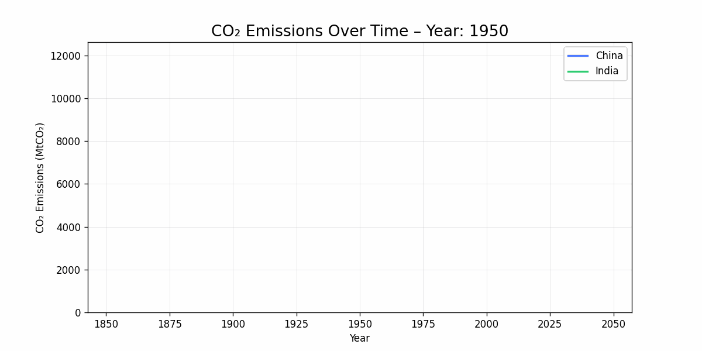

# 🌍 CO₂ Emissions Visualization Project

Interactive & animated visualizations of global fossil CO₂ emissions (1950–2022)

---

## Overview
This project visualizes global fossil CO₂ emissions over time using both **interactive Plotly charts** and **animated GIFs**.  
The goal is to tell a clear story of major emitters (US, China, India) and highlight trends and changes over the last decades.

---

## Dataset
We used the following dataset:

- **Source:** [Kaggle – Global Fossil CO₂ Emissions by Country (2002–2022)](https://www.kaggle.com/datasets/thedevastator/global-fossil-co2-emissions-by-country-2002-2022?utm_source=chatgpt.com)
- **CSV filename:** `GCB2022v27_MtCO2_flat.csv`
- **Key columns:** `Country`, `ISO 3166-1 alpha-3`, `Year`, `Total`, `Coal`, `Oil`, `Gas`, `Cement`, `Flaring`, `Other`, `Per Capita`

---

## Visualizations

### 1. Interactive Plotly Chart
This chart allows users to:

- Hover over lines to see exact CO₂ emissions.
- Watch emissions grow dynamically year by year.
- Compare trends for US, China, and India.

**Saved as:** `co2_emissions_kaggle.html`


---

### 2. Animated GIF
The GIF shows year-by-year growth of emissions for the same countries:

- Lines grow over time to show trends clearly.
- Filtered from 1950 onwards to avoid early zeros.

**Saved as:** `co2_emissions_kaggle.gif`



---

## Setup Instructions

```bash
pip install pandas plotly matplotlib imageio
python main.py
